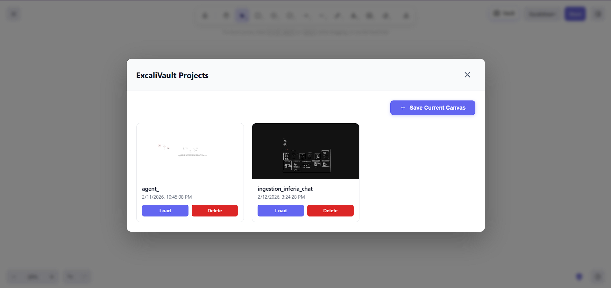

# ExcaliVault

A minimal browser extension to save and manage Excalidraw canvas snapshots as projects.

## Features

- **Save Current Canvas**: Quick snapshot of your current Excalidraw work.
- **Project Dashboard**: View all saved projects with automatic thumbnails.
- **Manage Projects**: Easily load previous snapshots or delete old ones.

The extension provides a clean modal interface directly on the Excalidraw dashboard to manage your local "vault" of drawings.

## Installation

1. Clone this repository.
2. Open `chrome://extensions/` in your browser.
3. Enable **Developer mode**.
4. Click **Load unpacked** and select the `extensions/excaliVault` folder.
